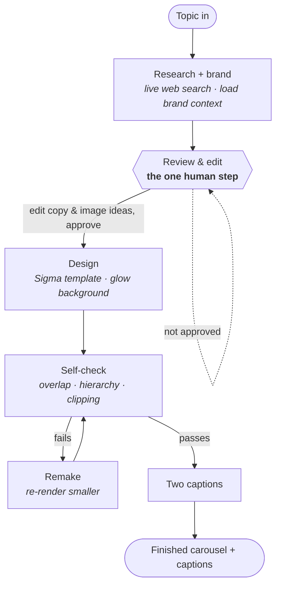

# Carousel Producer

Give it a topic. It researches the topic live, drafts a slide-by-slide outline,
pauses for one human review, generates an image per slide, lays everything out on
a branded **Sigma** template, checks its own work for overlaps and clipping, and
writes two caption options. The output is a finished, on-brand Instagram carousel
(1080 × 1350) plus captions — not a pile of assets you still have to assemble.

The whole thing is driven by one topic string and one brand file. Branding is
configuration, so the same engine renders anyone's deck from their own colours,
fonts, handle, and assets.

## Pipeline



The image step sits inside **Design**: for each slide's image idea, a pluggable
provider produces the picture, then the slide is laid out on its Sigma template.

## How it works

1. **Topic in.** You pass one topic string.
2. **Research + brand.** A live web search (Claude's `web_search` tool) gathers
   current facts and angles; the brand file is loaded for voice, handle, colours,
   and assets.
3. **Review & edit — the one human step.** Before any image or slide is made, the
   outline (every slide's copy + its image idea) is written to `outline.json` and
   the run pauses. You edit any line or image concept and approve. Nothing else in
   the pipeline asks for a human.
4. **Images.** For each slide's image idea, a pluggable `ImageProvider` makes the
   picture. Three ship: a stub placeholder (no keys), a web image-search provider,
   and a Nano Banana (Gemini) generator. Adding a provider is one new class.
5. **Design.** Each slide is composited on one of three Sigma templates — Sigma
   Dark, Sigma Light, or Sigma Hybrid (alternating) — with a NumPy radial-glow
   background, header, headline/body, image card, and CTA headshot.
6. **Self-check + remake.** The renderer records the bounding box of everything it
   draws. The checker measures those boxes: no clipping past the safe area, no
   overlaps, and a title that out-sizes body copy. Any slide that fails is
   re-rendered at a smaller font scale, up to a retry cap.
7. **Two captions.** The producer drafts two distinct captions and lets you pick.

## Branding is configuration

Nothing about a specific person or company lives in the code. A single
`brand.yaml` supplies everything visual:

```yaml
name: "Your Brand"
handle: "@yourhandle"
style: "sigma-dark"          # sigma-dark | sigma-light | sigma-hybrid
colors:
  primary: "#ed5500"         # accent + highlighted words + CTA ring
  secondary: "#2ec0ff"
  dark_bg: "#000000"
  light_bg: "#f8f8f8"
fonts:
  regular: "assets/fonts/Poppins-Regular.ttf"
  # ... other weights, plus a 'mono' for prompt slides
assets:
  logo: "assets/logo.png"
  headshot: "assets/headshot.jpg"
```

The engine reads colours, fonts, handle, and assets from this object and never
hard-codes an identity. See [`brand.example.yaml`](brand.example.yaml) for the
full schema, and [`examples/example_brand.yaml`](examples/example_brand.yaml) for
a zero-asset file you can run immediately.

## Tech stack

| Layer            | Choice                                   | Why |
| ---------------- | ---------------------------------------- | --- |
| Rendering        | Pillow (PIL)                             | Precise text layout and compositing |
| Backgrounds      | NumPy                                    | Vectorised gaussian radial-glow |
| Research/copy    | Anthropic Claude (`claude-opus-4-8`)     | Web search + structured outline + captions |
| Image generation | Google Gemini "Nano Banana" (`google-genai`) | On-brand generated imagery |
| Image search     | Any JSON image-search API (`requests`)   | Real photos as an alternative source |
| Config           | PyYAML + python-dotenv                   | Brand as data; secrets in env |

## Project structure

```
carousel-producer/
├── README.md
├── LICENSE
├── .env.example
├── .gitignore
├── requirements.txt
├── config.py                 # settings from environment
├── brand.example.yaml        # brand config schema
├── carousel/
│   ├── pipeline.py           # orchestrator (topic -> finished deck)
│   ├── research.py           # web-search research + outline drafting (Claude)
│   ├── review.py             # human-in-the-loop review gate
│   ├── images.py             # ImageProvider interface + stub / web-search / Nano Banana
│   ├── render.py             # Sigma renderers (PIL + NumPy glow)
│   ├── themes.py             # Sigma Dark / Light / Hybrid tokens
│   ├── selfcheck.py          # overlap / hierarchy / clipping checks
│   ├── captions.py           # two caption options (Claude)
│   └── brand.py              # loads brand.yaml
└── examples/
    └── example_brand.yaml    # runnable, no external assets
```

## Setup

```bash
python -m venv .venv && source .venv/bin/activate
pip install -r requirements.txt
cp .env.example .env         # add keys (optional — see below)
```

Run it — the first pass stops at the review gate, the second finishes:

```bash
# 1. Research + draft; writes output/outline.json and pauses
python -m carousel.pipeline --topic "how to price a freelance project" \
    --brand examples/example_brand.yaml

# 2. Edit output/outline.json, then approve to finish
python -m carousel.pipeline --topic "how to price a freelance project" \
    --brand examples/example_brand.yaml --approve
```

Or approve inline in one run with `--interactive`. Choose an image source with
`--provider stub|web_search|nano_banana` (defaults to `stub`).

**Runs with no keys.** With no API keys set, research and captions fall back to
sensible offline drafts and the `stub` provider draws labelled placeholder image
cards — so you can exercise the full pipeline, then add keys to make it live.

## Security notes

- Secrets live only in `.env` (git-ignored). `.env.example` contains placeholders.
- No credential, token, personal email, phone number, or private asset is baked
  into the code — brand identity is supplied at runtime via `brand.yaml`.
- Generated output and brand assets are git-ignored so nothing personal is
  committed by accident.

## License

MIT © 2026 Hermann Ndamen — <https://www.hermannndamen.com>
